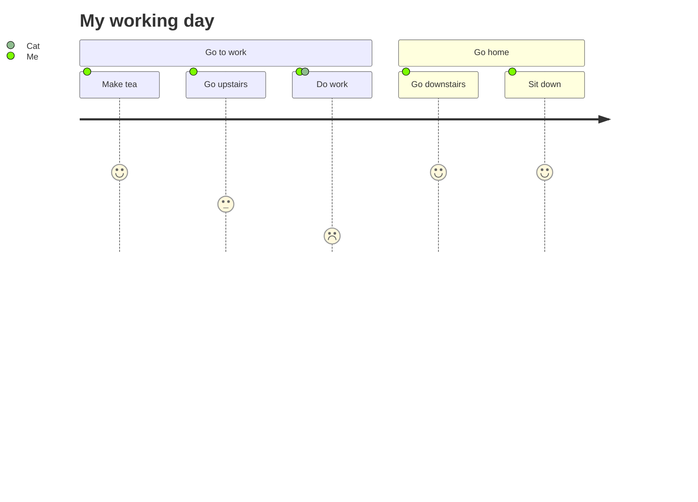

# journey

Mermaid's documentation examples, from Pele 1.13.0's test corpus; each renders on the site. Written by `pnpm run vendor-artifact-share` in opencode-office; don't edit.

```mermaid
journey
    title My working day
    section Go to work
      Make tea: 5: Me
      Go upstairs: 3: Me
      Do work: 1: Me, Cat
    section Go home
      Go downstairs: 5: Me
      Sit down: 5: Me
```
